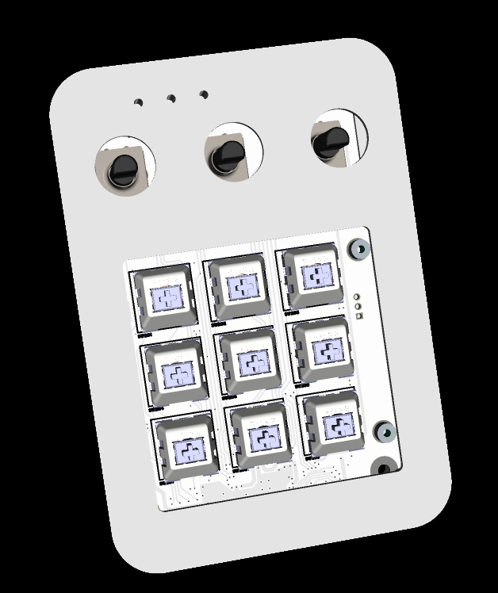

# Stratus Hackpad

>Stratus is a transparent macro controller engineered to expose the essentials. Built around a custom PCB and layered acrylic structure, it transforms raw circuitry into functional design.

---

## Overview

The **Stratus Hackpad** is a DIY macropad designed for productivity, creative shortcuts, and anyone who wants a fully customisable device sitting next to their keyboard. It features nine hot-swap mechanical key switches in a 3×3 layout, three rotary encoders with push-click switches, per-key addressable RGB LEDs viewable through transparent light guides, and a USB-C connection — all controlled by the Raspberry Pi RP2040 microcontroller.

---

## Tutorial Playlist

A full step-by-step video tutorial series covering everything from sourcing parts to flashing firmware is coming soon. Follow along to build your own Stratus Hackpad from scratch!

> **[Tutorial Playlist — Coming Soon]**

The playlist will cover PCB ordering, soldering the SMD components, assembling the case, flashing QMK/KMK firmware, and customising your layout.

---

## Photos

| Assembled | Inside | PCB |
|-----------|--------|-----------------|
|  |  |  |

| Case Showcase | Schematic — MCU Page | Schematic — Other |
|---|---|---|
|  |  |  |

---

## Bill of Materials (PCB)

All PCB components are sourced primarily from **LCSC**, with standoffs from **Farnell**.

| # | Qty | Component | Designator | Part Number | Supplier |
|---|-----|-----------|------------|-------------|----------|
| 1 | 7 | Cap 2.2µF 0402 | C101, C105–C107, C201, C202, C207 | CL05A225MQ5NSNC | LCSC C12530 |
| 2 | 21 | Cap 100nF 0402 | C102–C104, C108–C109, C113–C116, C125–C127, C210–C218 | CL05B104KO5NNNC | LCSC C1525 |
| 3 | 4 | Cap 1µF 0402 | C110, C111, C118, C119 | CL05A105KA5NQNC | LCSC C52923 |
| 4 | 1 | Cap 47µF 1206 | C112 | CL31A476MPHNNNE | LCSC C96123 |
| 5 | 2 | Cap 15pF 0402 | C123, C124 | CL05C150JB5NNNC | LCSC C86285 |
| 6 | 6 | Cap 10nF 0402 | C203–C206, C208, C209 | CL05B103KB5NNNC | LCSC C15195 |
| 7 | 4 | TVS Diode (bi-dir) | D101–D104 | GG0402052R542P | LCSC C1973257 |
| 8 | 12 | Schottky Diode 1N5819WS | D201–D212 | 1N5819WS | LCSC C191023 |
| 9 | 3 | Rotary Encoder PEC12R | ENC201–ENC203 | PEC12R-4120F-S0012 | LCSC C143801 |
| 10 | 1 | USB-C Connector 16-pin | J101 | TYPE-C 16PIN 2MD(073) | LCSC C2765186 |
| 11 | 9 | Kailh Hot-swap Socket | J201–J209 | CPG151101S11-16 | LCSC C5156480 |
| 12 | 1 | RGB LED Array (status) | LED101 | NH-B1010RGBT-HF | LCSC C2874113 |
| 13 | 1 | LED Green 0805 | LED102 | KT-0805G | LCSC C2297 |
| 14 | 1 | LED Yellow 0805 | LED103 | KT-0805Y | LCSC C2296 |
| 15 | 9 | SK6812MINI-E RGB LED | LED201–LED209 | SK6812MINI-E | LCSC C5149201 |
| 16 | 4 | Standoff M2.5×3.5mm | MH201–MH204 | 3757968 | Farnell |
| 17 | 1 | Resistor 200Ω 0402 | R101 | 0402WGF2000TCE | LCSC C25087 |
| 18 | 1 | Resistor 100mΩ 1206 | R102 | 1206W4F100LT5E | LCSC C25334 |
| 19 | 7 | Resistor 1kΩ 0402 | R103–R107, R121, R124 | 0402WGF1001TCE | LCSC C11702 |
| 20 | 7 | Resistor 27Ω 0402 | R108–R112, R117, R125 | 0402WGF270JTCE | LCSC C25100 |
| 21 | 4 | Resistor 0Ω 0402 | R113–R116 | 0402WGF0000TCE | LCSC C17168 |
| 22 | 2 | Resistor 5.1kΩ 0402 | R118, R119 | 0402WGF5101TCE | LCSC C25905 |
| 23 | 13 | Resistor 10kΩ 0402 | R123, R201–R212 | 0402WGF1002TCE | LCSC C25744 |
| 24 | 2 | Tactile Switch 5.1mm | SW101, SW102 | TS-1187A-B-A-B | LCSC C318884 |
| 25 | 9 | Kailh Switch CPG151101S21 | SW201–SW209 | CPG151101S21 | LCSC C404351 |
| 26 | 1 | RP2040 MCU | U101 | RP2040 | LCSC C2040 |
| 27 | 1 | LDO Regulator 3.3V | U102 | LM3940IMP-3.3/NOPB | LCSC C140319 |
| 28 | 1 | Buffer SN74LV1T34 | U103 | SN74LV1T34DBVR | LCSC C100024 |
| 29 | 1 | Flash 128Mbit SPI | U104 | W25Q128JVSIQ | LCSC C97521 |
| 30 | 1 | Crystal 12MHz | Y101 | ABM8-272-T3 | LCSC C20625731 |

---

### Hardware to Buy

- **9× Keycaps** — e.g. Mouser `474-PRT-15305`
- **4× Rubber feet** — Farnell `2494552`
- **2× M3×10 self-tapping screws**
- **2× M3×12 self-tapping screws**
- **4× M2.5×8 black machine screws**
- **Gorilla Super Glue Gel** — Farnell `3532524`

### 3D Printed Parts — Colour #1 (main body colour)

- 1× Box bottom
- 1× Box top
- 1× Switch plate (can also be CNC machined)
- 3× Encoder knob (body)

### 3D Printed Parts — Colour #2 (accent colour)

- 1× Frame around buttons
- 3× Frame around encoders
- 3× Encoder knob top

### 3D Printed — Transparent Filament

- 3× Short pieces used as LED light guides (one per encoder/LED position)
---

## Firmware

The Stratus Hackpad is compatible with both **QMK** and **KMK** (CircuitPython-based). Starter configuration files are provided.

---

## Contributing

Pull requests and issues are welcome! If you build one, share a photo — it's always great to see the community's builds.

# Set shortcuts
To set shortcuts on your keyboard, use VIA.
1. When connecting your keyboard for very first time, go to https://usevia.app/design click LOAD and use keyboard_layout_for _VIA.json to see your keyboard in VIA
1. To change shortcuts, go to https://usevia.app/ and in the right top corner click on "Authorize New +"
1. Pair your Stratus Hackpad
1. Set shortcuts

# Steps to update firmware
1. Connect your keyboard to PC
1. Double tap the reset button on your keyboard
1. Keyboard will show up as an USB storage
1. Copy and paste uf2 firmware file from your PC directly to the USB storage main directory
